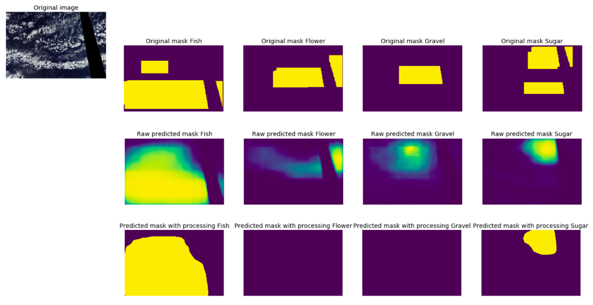
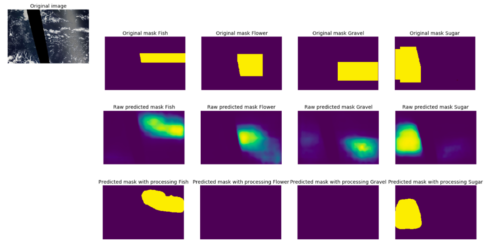

## Understanding cloud organization

----
https://www.kaggle.com/c/understanding_cloud_organization
top-5% solution

#### Task
Identify and segment the required class of cloud organization from given satellite images.

#### Types of networks
* UNet with resnet backbone for segmentation
* FPN with resnet backbone for segmentation

#### Data
* 5-fold split
* Resize to (256, 384)
* Augmentation with hflip, vflip, shift/scale/rotate
* TTA with hflip, vflip, rotate90

#### Optimizer
* Adam with 1-cycle scheduler
* BCE+Dice Loss

#### Environment
kaggle kernel with nvidia tesla p100  
nvidia [apex](https://www.kaggle.com/shutil/nvidia-apex)  
pytorch 1.2.0  
albumentations 0.3.3  
segmentation-models-pytorch 0.0.3  
